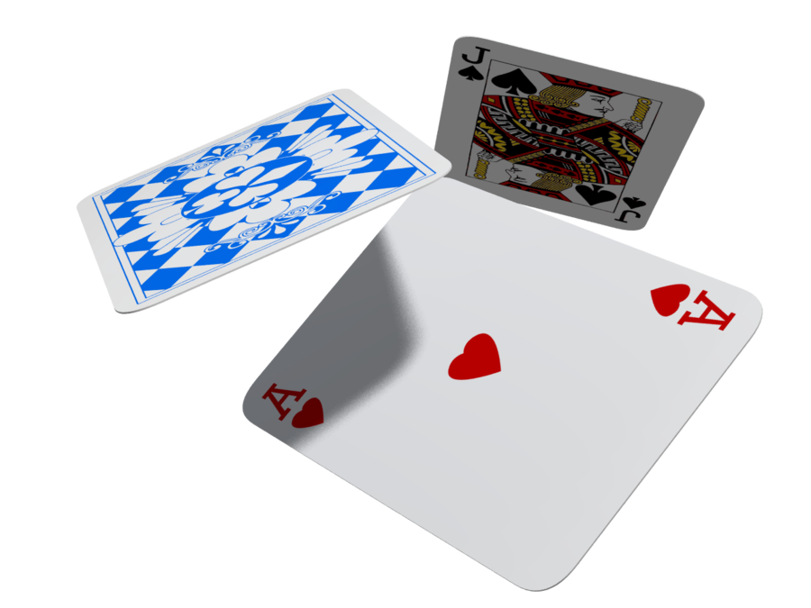
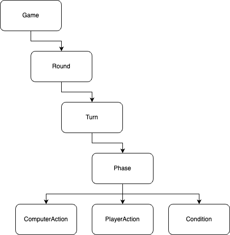
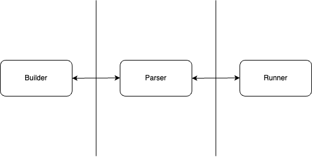
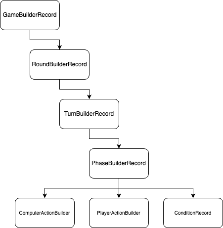

# Midpoint Presentation - Team 1

---

# Project Overview

---

# Team Goals

* Design a game editing suite to create card games
    * Rummy (e.g. Gin Rummy, Rummy 500)
    * Trick-taking (e.g. Hearts, Spades)

---

# Intended Features

* Create a variety of games by defining modular "phases"
* Support customization for decks, rules, and styles
* Play and progress in user-built games
* Connect with web-based features to enhance user experience

---

# Team Workflow

* Approach
    * Parallel development
* Communication
    * Full team meetings 2-3 times/week
    * Frequent subteam meetings
    * JavaDoc/Markdown documentation
* Git
    * Separate feature branches
    * Merge requests to main
* Collaboration
    * Pair programming
    * Inter-team work through interfaces

---

# Sprint 1: Planning + Prioritization

* Laying extendable, flexible code foundations
    * Solidifying declared patterns and hierarchies
    * Clarifying interactions at each interface
    * Completing basic implementations/mocks
        * Builder
        * Parser
        * Runner

---

# Sprint 2: Integration (MVP)

* Building towards start-to-finish functionality
    * Integrating each team's work
    * Developing thorough testing suites
    * Expanding "sad-case" error handling
    * Mapping out trajectories for extensions

---

# Sprint 3: Maintenance + Extension

* Tidying up and going forward
    * Fully integrate game runner loop
    * Consolidate branches and packages
    * Explore extensions by subteam
    * Leverage app to expand game library

---

# Design

---

# Overview: Unifying Game Structure

---

# Overview: Teams

* Project is split into three parts:
    * Builder: App to build games
    * Parser: Tool to write games to files, read games from files
    * Runner: App to run games

      

---

# Overview: Builder

* Purpose:
    * To provides UI to define game setup, rules for each turn, and non-player actions.
    * To create GameObjectRecord object that stores all game information.
* Structure:
    * Condensed MVC loop
    * Hierarchy of records

---

# Overview: Builder (cont.)

---

# Overview: Parser

* Purpose:
    * To write built game objects to JSON files
    * To read and configure game objects from JSON files
* Structure:
    * BuilderParser interface
        * BuilderJSONParser class
        * OS validation strategies
    * RunnerLoader interface
        * RummyLoader class
        * Action and condition factories
        * RunnerParser interface
            * RunnerJSONParser class

---

# Overview: Runner

* Purpose:
    * To run custom-built games by users
* Structure:
    * Model-View-Controller structure
    * Model-View Observers
    * GameStage
    * Game Loop
    * Board
    * Player
    * Frontend

---

# Extendable & Closed Features

* Builder
    * Additional customization options
    * New Actions can be added and compiled down to runner compatible JSON
* Parser
    * New file formats (XML, CSV, Java Properties)
    * Bolstered "validation" strategies
* Runner
    * Additional player actions
    * Additional computer actions
    * Additional player-specific information

---

# API Example #1: Serializing to JSON

* Interface: BuilderParser
* Method call: `void saveGame(GameBuilderRecord gameRecord) throws RuntimeException;`
* Service: saving to file and OS-specific error checking
* Advantages:
    * Transparency
    * Encapsulation
    * Simplicity

---

# API Example #2: External Assistance

* Interface: ExternalAssistance
* Method call: `void provideAdvice(String userPrompt);`
* Service: provides a standardized method to integrate various external assistance services into
  runner view
* Advantages:
    * Abstraction
    * Encapsulation
    * Decoupling

---

# Use Case #1: Configuring a game

* User wishes to build a rummy game
    * Enters general file details
    * Game setup
    * Pre-turn, post-turn, and round setup
    * Details on each phase of gameplay
        * Rules/Constraints
        * Allowed moves
    * Returns a Game object to be saved as a JSON file.

---

# Use Case #2: Player ends turn

* User wishes to end phase after doing their moves
    * user presses "End Phase" button
    * button EventHandler calls GameStage.step()
    * GameStage.step() calls RoundStage.step()
    * RoundStage.step() calls TurnStage.step()
    * TurnStage.step() calls PhaseStage.step()
    * PhaseStage.step() calls Board.updateAllowedMoves() and Board.updatePhaseCondition()
    * Observers notify updates to Board --> User interface.

---

# Alternatives

* Condition checking:
    * Current design: Lazy checking
        * Free card movement
        * Phase-end validity checks
    * Alternative: Synchronous checking
        * Restricted card movement
        * Real-time validity checks
    * Decision: Lazy checking
        * Reduced action-condition coupling
        * Sensible interface
        * Consistent with design

---

# Functionality

* Creating a game in builder
* Loading a game from file
* Gameplay UI elements
* ChatGPT integration

---

# Attributions

* Card game
  image: https://www.google.com/url?sa=i&url=https%3A%2F%2Fwww.freepnglogos.com%2Fpics%2Fcards&psig=AOvVaw3YzofV1ycOU_Caqc9dBZtS&ust=1681426827499000&source=images&cd=vfe&ved=0CBIQjhxqFwoTCKiB_Ze5pf4CFQAAAAAdAAAAABAw
* Diagrams generated with: https://app.diagrams.net/