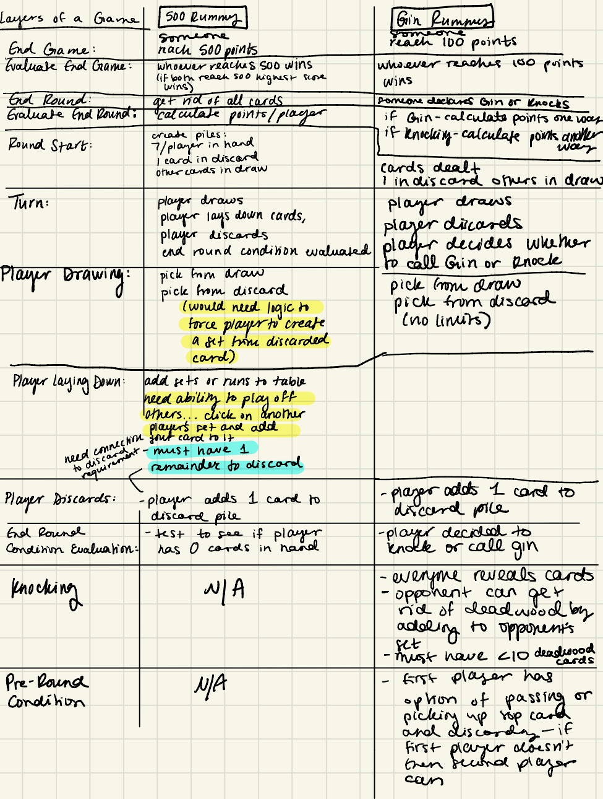

*Describe in detail at least three example games from your genre or game variations that differ significantly in their functionality. These example games should help clarify the abstractions you plan to use in your design, so explain why you chose them and clearly identify their functional commonalities and differences. Note, they do not need to be the final ones you implement but certainly could be.* 

## Gin Rummy

Two players max
The player attempts to create sets or runs out of their entire hand by drawing and discarding cards.
Options for drawing are the top card of the discard pile or the top card of the draw pile.
When the player has Gin (all sets/runs) or less than 10 points worth of unmatched cards, they can lay down their cards which is called knocking.
If the player hasn't gone Gin, the opposing player then can match their unmatched cards to the player's sets/runs. The winning player gains the difference in points between their score (matched-unmatched) and their opponent's score (matched-unmatched).

## Oklahoma Gin Rummy

This is a very similar game to Gin Rummy however the first card pulled on the first play is used to determine the max deadwood point value required for knocking.
If the knocker has no unmatched cards, it's known as going gin and he scores 25 bonus points (some sources say the bonus should be 20 points). Additionally, his opponent cannot score any points, even if his opponent also had no unmatched cards.

500 Rummy is a variation of Gin Rummy in which the player can lay down their cards at the end of each turn. Other players can play off of eachothers
set and run. Additionally, in this gam players can pick between the draw pile and pulling from anywhere in the discard pile. The round ends when a player is able to lay down all of their cards. Each person gets a score equal to their matched cards on the table vs their unmatched cards. 

## Contract Rummy

The goal is to dispose of all your cards by melding (creating groups or sequences), laying off, and discarding.
Melding can only be done after fulfilling your contract for the round being played.
There are two types of melds: sequences (at least four consecutive cards of the same suit) and groups (three cards of the same rank, regardless of suit).
Sequences can be extended by adding consecutive cards at either end, up to the ace.
Groups can be extended by adding more cards of the same rank.
When a player goes out (disposes of all their cards), the other players score penalty points for the cards remaining in their hands.
The game consists of seven rounds, each with a different contract:
Two groups of 3 (6 cards)
One group of 3 and one sequence of 4 (7 cards)
Two sequences of 4 (8 cards)
Three groups of 3 (9 cards)
Two groups of 3 and one sequence of 4 (10 cards)
One group of 3 and two sequences of 4 (11 cards)
Three sequences of 4, and no discard.

## Summary

The main variations all have several commonalities. There is the basic structure of picking from a deck, organizing cards into subsets of some type, and discarding cards. Some games have additional
phases such as laying cards out in front of the player or having the option to knock. From these key themes, the game can split up into a set of different phases and possible actions in each phase. By 
creating phase abstractions and action abstractions that can be organized in any order, games of many varieties will be able to be built. Differences in these games come in terms of where card can be drawn from, where they can be laid down, 
when an end condition/goal has been met, and how points are determined at the end of the game. 

