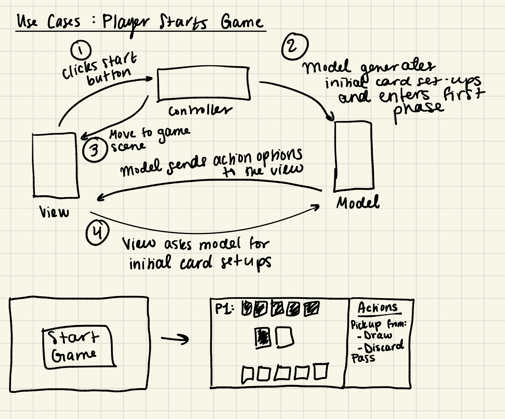

### Generic Use Cases
* User starts a game
* User wishes to advance to the next phase
* User draws 1 card from the draw pile
* User discards 1 card to the discard pile
* User places valid card on board
* User reorganizes the order of cards in hand
* User wishes to see info about other players (# of remaining cards, points, etc)
* User wins game
* User loses game
* User declares end of game
* User exits game
### Error Use Cases
* User draws more cards than is allowed
* User discards more cards than is allowed
* User puts down a card that cannot be played
* (Generically) User tries to advance to another phase without satisfying requirements

